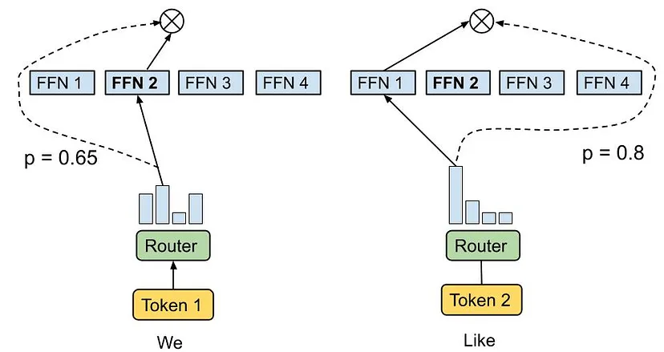
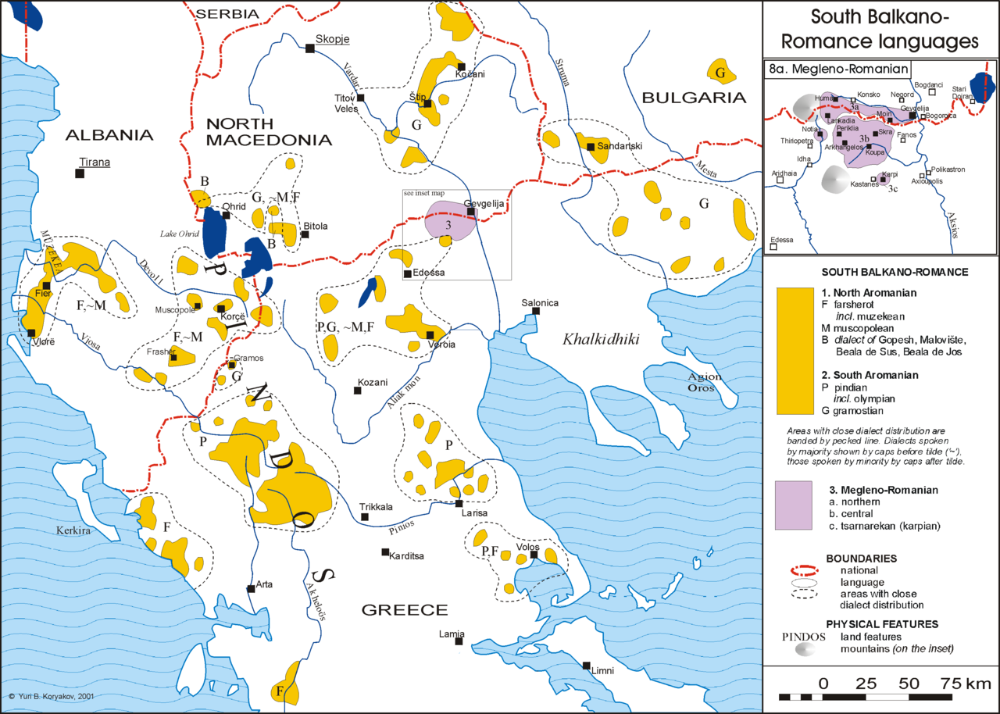
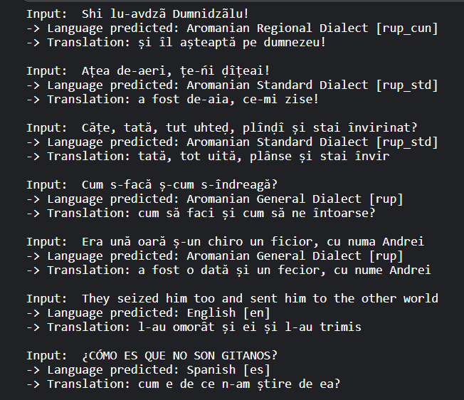

# Mixture of Experts Presentation

## Introduction to Mixture of Experts

- Mixture of Experts (MoE) is a machine learning ensemble approach.
- It involves a set of specialized models (experts) and a gating network (router).
- Each expert learns to handle a subset of the data.
- The router dynamically selects which expert to use for a given input.
- MoE models can outperform single models on complex tasks.

## History of Mixture of Experts

- The concept of Mixture of Experts was introduced by Jacobs, Jordan, Nowlan, and Hinton in their seminal paper in 1991.
- Titled "Adaptive Mixtures of Local Experts", the paper presented a novel way to combine the outputs of multiple models through a trainable gating network.
- This method was groundbreaking for its time, demonstrating how different parts of a data set could be learned more effectively by different "expert" models, with the gating mechanism deciding which expert to use for each input.

## Sketch of a Mixture of Experts

Below are visual representations of the Mixture of Experts architecture:

- **Overall Architecture**:

  

  _A high-level overview of the Mixture of Experts model, showcasing the gating mechanism and multiple expert networks._

- **Experts and Gating Network**:

  

  _Detailed view of how each expert specializes in a different aspect of the data and how the gating network selects an expert based on the input._

## Distribution of Aromanian Language in the Balkan Peninsula

The Aromanian language, a Latin-derived language closely related to Romanian, is spoken by the Aromanian community scattered across the Balkan Peninsula. This section highlights the geographical distribution of the Aromanian language and its dialects, underscoring the cultural and linguistic diversity within this region.

The need for a translation model specifically tailored to Aromanian dialects and Romanian arises from the desire to bridge communication gaps, preserve cultural heritage, and facilitate the documentation and study of this unique linguistic landscape. By developing such a model, we aim to support the Aromanian-speaking communities, providing tools for better access to information and fostering closer ties with the Romanian-speaking world.



_This map illustrates the distribution of the Aromanian language across the Balkan Peninsula, showcasing the areas where various Aromanian dialects are spoken._

## Implementing MoE for Language Translation

This demo illustrates the application of the Mixture of Experts model for translating texts from multiple languages and dialects to Romanian. Here's how it was structured:

- **Multiple Experts**: Created individual models fine-tuned for translating specific languages or dialects to Romanian.
  - Expert 1: Translates Aromanian General Dialect to Romanian.
  - Expert 2: Translates Aromanian Standard Dialect to Romanian.
  - Expert 3: Translates Aromanian Regional Dialect.
  - Expert 4: Translates English to Romanian.
  - (and so on for each language)
- **Router (Logistic Regression)**: Implemented a logistic regression model to predict the language of the input text. Based on this prediction, the corresponding expert is chosen for translation.

### About Our Dataset

The dataset is organized in a CSV file with 2111 rows, each row featuring the same phrase translated into multiple languages or dialects, including its translation to Romanian.

- **Dataset Overview**:

| id  | ro                             | rup                       | rup_std                   | rup_cun                   | en                                  | es                                         | fr                                   | split |
| --- | ------------------------------ | ------------------------- | ------------------------- | ------------------------- | ----------------------------------- | ------------------------------------------ | ------------------------------------ | ----- |
| 0   | fata, biata de ea, înnebunise. | mărata feată, eara zurlă. | mărata feată, eara zurlă. | mãrata featã, eara zurlã. | the girl, poor thing, had gone mad. | la chica, pobrecita, se había vuelto loca. | la pauvre fille était devenue folle. | test  |

### Translation Model

Each expert model was fine-tuned using the `t5-small` architecture, customized for the specific language or dialect it was designed to translate. This process involved:

- Loading the pre-trained `t5-small` model and tokenizer.
- Training each model on our dataset, optimizing it to understand and translate the nuances of its assigned language or dialect to Romanian.

- **Demo Code Integration**:

  ```python
  # Code to predict language and select the appropriate expert for translation
  predicted_language = logistic_regression_model.predict(input_text)
  expert = select_expert(predicted_language)
  translation = expert.translate(input_text)
  ```

- **Demo Output Visualization**: To demonstrate the efficacy of our model, here is a snapshot of how it seamlessly translates texts from various languages into Romanian, accurately identifying each language or dialect from the input:

  

- **Results**: Briefly mention the effectiveness of this approach, highlighting any improvements in translation quality or efficiency.

## Conclusion

- The Mixture of Experts model leverages the strengths of specialized models to handle complex translation tasks efficiently.
- By dynamically selecting the appropriate expert, the MoE model can achieve high accuracy across a range of languages and dialects.
- This demo showcases the practical application of MoE in enhancing machine translation capabilities.
